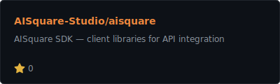
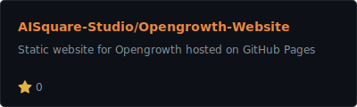

<!-- Hero Banner -->
<div align="center">
  <picture>
    
  </picture>
</div>

<br/>

<div align="center">

  <!-- Badges -->
  <a href="https://aisquare.studio"></a>
  <a href="https://docs.aisquare.studio"></a>
  <a href="https://github.com/AISquare-Studio"></a>
  <a href="https://feedback.aisquare.studio"></a>

</div>

<br/>

## 🔷 About Us

**AISquare Studio** builds the **governance layer for AI agents**. We create open-source tools that record _why_ AI decisions are made, enforce policies on what agents can do, and give humans structured workflows to review, approve, or intervene — without replacing your existing agent framework.

> Think of us as the system of record for AI decisions, the same way financial systems track transactions.  
> Except the transactions are *"the AI decided to email your CEO at 3 AM."*

<br/>

---

## 🏗️ What We're Building

<!-- AI Extends You — product showcase -->
<div align="center">
  <picture>
    
  </picture>
</div>

<br/>

<table>
  <tr>
    <td width="50%" valign="top">
      <h3 align="center">🛡️ Governance & Audit</h3>
      <p align="center">Full decision audit trails for AI agents — every action logged, every policy enforced, every override documented.</p>
    </td>
    <td width="50%" valign="top">
      <h3 align="center">🧪 Automated QA</h3>
      <p align="center">Turn plain-English test descriptions into real Playwright tests — powered by AI, triggered from your PRs.</p>
    </td>
  </tr>
  <tr>
    <td width="50%" valign="top">
      <h3 align="center">⚙️ Agent Orchestration</h3>
      <p align="center">Django-native framework for agentic workflows — DB-based job management, YAML pipelines, real-time event streaming.</p>
    </td>
    <td width="50%" valign="top">
      <h3 align="center">🔌 SDK & Integrations</h3>
      <p align="center">Client libraries and adapters for LangChain, CrewAI, AutoGen — plug governance into your existing stack.</p>
    </td>
  </tr>
</table>

<br/>

---

## 📦 Our Repositories

<p align="center">Click on a card to explore the project. ⭐ Star your favorites to show support!</p>

<!-- Row 1: Flagship repos -->
<div align="center">
  <a href="https://github.com/AISquare-Studio/AISquare-Studio-QA">
    
  </a>
  &nbsp;&nbsp;
  <a href="https://github.com/AISquare-Studio/awesome-aisquare">
    
  </a>
</div>

<br/>

<!-- Row 2: More repos -->
<div align="center">
  <a href="https://github.com/AISquare-Studio/django-ais">
    
  </a>
  &nbsp;&nbsp;
  <a href="https://github.com/AISquare-Studio/aisquare">
    
  </a>
</div>

<br/>

<!-- Row 3 -->
<div align="center">
  <a href="https://github.com/AISquare-Studio/Opengrowth-Website">
    
  </a>
</div>

<br/>

---

## 🧩 How the Pieces Fit Together

```
┌─────────────────────┐     ┌────────────────────────┐     ┌───────────────────────┐
│     Your Agent      │────▶│   AISquare Governance  │────▶│       AutoQA          │
│  (any framework)    │     │   (audit + policy)     │     │  (test generation)    │
└─────────────────────┘     └────────────────────────┘     └───────────────────────┘
                                       │
                                       ▼
                            ┌────────────────────────┐
                            │      django-ais        │
                            │   (orchestration)      │
                            └────────────────────────┘
                                       │
                                       ▼
                            ┌────────────────────────┐
                            │    AISquare SDK        │
                            │  (client libraries)    │
                            └────────────────────────┘
```

Your agent framework handles reasoning. **AISquare handles the *"wait, should you actually do that?"* part** — recording decisions, enforcing policies, and routing to human review. **AutoQA** validates behavior through generated tests. **django-ais** orchestrates multi-step workflows inside Django.

<br/>

<!-- Platform visual -->
<div align="center">
  <picture>
    
  </picture>
</div>

<br/>

---

## ⚡ Quick Start

### AutoQA — AI-powered test generation in your PRs

```yaml
# .github/workflows/autoqa.yml
name: AutoQA
on:
  pull_request:
    types: [opened, edited, synchronize]

jobs:
  autoqa:
    runs-on: ubuntu-latest
    steps:
      - uses: actions/checkout@v4
      - uses: AISquare-Studio/AISquare-Studio-QA@main
        with:
          openai_api_key: ${{ secrets.OPENAI_API_KEY }}
          staging_url: ${{ secrets.STAGING_URL }}
          mode: generate
```

Write tests in plain English inside your PR body, and AutoQA turns them into real Playwright tests. ✨

<br/>

### django-ais — agentic workflows in Django

```bash
pip install django-ais
```

```python
from django_ais import Worker

class SummaryWorker(Worker):
    name = "summarizer"

    def execute(self, job):
        return {"summary": summarize(job.payload["text"])}
```

Define workflows in YAML, stream events over SSE/WebSocket, and manage jobs through the Django ORM.

<br/>

---

## 🗺️ Roadmap

<p align="center">
  💡 Click on a card to explore the task progress<br/>
  🤝 Your reactions guide development! Add a ❤️ to your favorite features
</p>

<!-- Status summary -->
<div align="center">
<table>
<tr>
<td align="center"><br/><h3>2</h3></td>
<td align="center"><br/><h3>2</h3></td>
<td align="center"><br/><h3>1</h3></td>
<td align="center"><br/><h3>4</h3></td>
</tr>
</table>
</div>

<!-- Roadmap cards -->
<table width="100%">

<tr><td>
<h4>🟢 <a href="https://github.com/AISquare-Studio/AISquare-Studio-QA">AutoQA GitHub Action</a></h4>


<br/>
🟩🟩🟩🟩🟩🟩🟩🟩🟩🟩 <b>100%</b> complete<br/>
<sub>AI-powered test generation from PR descriptions</sub>
</td></tr>

<tr><td>
<h4>🟢 <a href="https://github.com/AISquare-Studio/django-ais">django-ais</a></h4>


<br/>
🟩🟩🟩🟩🟩🟩🟩🟩🟩🟩 <b>100%</b> complete<br/>
<sub>Django-native orchestration for agentic workflows</sub>
</td></tr>

<tr><td>
<h4>🟢 <a href="https://github.com/AISquare-Studio/awesome-aisquare">awesome-aisquare</a></h4>


<br/>
🟩🟩🟩🟩🟩🟩🟩🟩🟩🟩 <b>100%</b> complete<br/>
<sub>Ecosystem hub with quickstarts and documentation</sub>
</td></tr>

<tr><td>
<h4>🟢 <a href="https://github.com/AISquare-Studio/aisquare">AISquare SDK</a></h4>


<br/>
🟩🟩🟩🟩🟩🟩🟩🟩🟩🟩 <b>100%</b> complete<br/>
<sub>Client libraries for direct API integration</sub>
</td></tr>

<tr><td>
<h4>🟡 aisquare-examples</h4>


<br/>
🟩🟩🟩⬜⬜⬜⬜⬜⬜⬜ <b>30%</b> complete · 3 done · 7 to do<br/>
<sub>Runnable governance scenario examples</sub>
</td></tr>

<tr><td>
<h4>🔵 aisquare-templates</h4>


<br/>
⬜⬜⬜⬜⬜⬜⬜⬜⬜⬜ <b>0%</b> complete<br/>
<sub>Starter scaffolds for governed AI apps</sub>
</td></tr>

<tr><td>
<h4>🔵 aisquare-integrations</h4>


<br/>
⬜⬜⬜⬜⬜⬜⬜⬜⬜⬜ <b>0%</b> complete<br/>
<sub>Adapters for LangChain, CrewAI, AutoGen</sub>
</td></tr>

<tr><td>
<h4>🟣 Dashboard</h4>


<br/>
<sub>Visual interface for audit trail exploration</sub>
</td></tr>

<tr><td>
<h4>🟣 Policy Engine v2</h4>


<br/>
<sub>Advanced rule builder for agent constraints</sub>
</td></tr>

</table>

<br/>

---

## 🤝 Get Involved

<!-- Community visual -->
<div align="center">
  <picture>
    
  </picture>
</div>

<br/>

<div align="center">

  <a href="https://github.com/AISquare-Studio/awesome-aisquare/blob/main/CONTRIBUTING.md"></a>
  <a href="https://github.com/orgs/AISquare-Studio/discussions"></a>
  <a href="https://feedback.aisquare.studio"></a>

</div>

<br/>

We welcome contributions across the entire ecosystem! Look for issues tagged **"good first issue"** across any of our repos — it's the perfect entry point.

<br/>

---

## 📬 Community & Support

| Channel | Link |
|:--------|:-----|
| 📖 **Documentation** | [docs.aisquare.studio](https://docs.aisquare.studio) |
| 🔌 **API Reference** | [docs.aisquare.studio/api-reference](https://docs.aisquare.studio/api-reference) |
| 🌐 **Website** | [aisquare.studio](https://aisquare.studio) |
| 💬 **Discussions** | [GitHub Discussions](https://github.com/orgs/AISquare-Studio/discussions) |
| 💡 **Feedback** | [feedback.aisquare.studio](https://feedback.aisquare.studio) |
| 🔒 **Security** | [Responsible Disclosure](https://github.com/AISquare-Studio/awesome-aisquare/blob/main/SECURITY.md) |
| ✉️ **Email** | [bots@aisquare.com](mailto:bots@aisquare.com) |

<br/>

---

<div align="center">

  <sub>Built with ❤️ by the <b>AISquare Studio</b> team — because your AI agents deserve accountability.</sub>

  <br/><br/>

  <a href="https://github.com/AISquare-Studio"></a>

</div>
